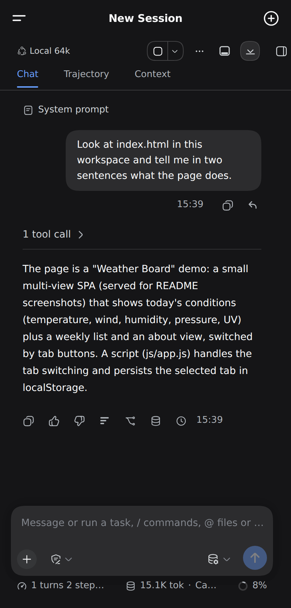
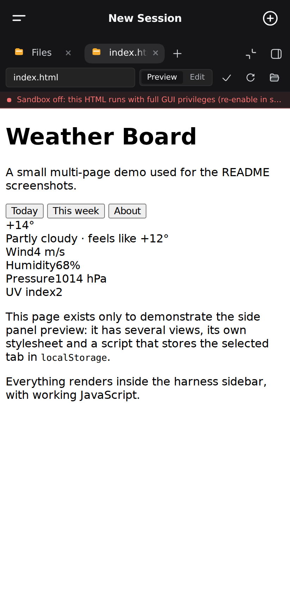
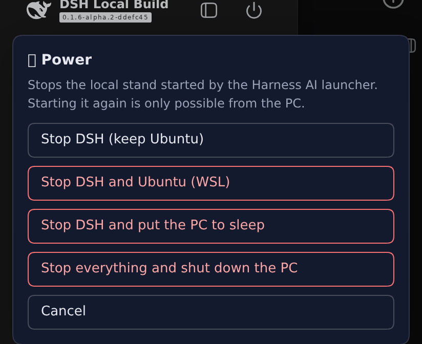
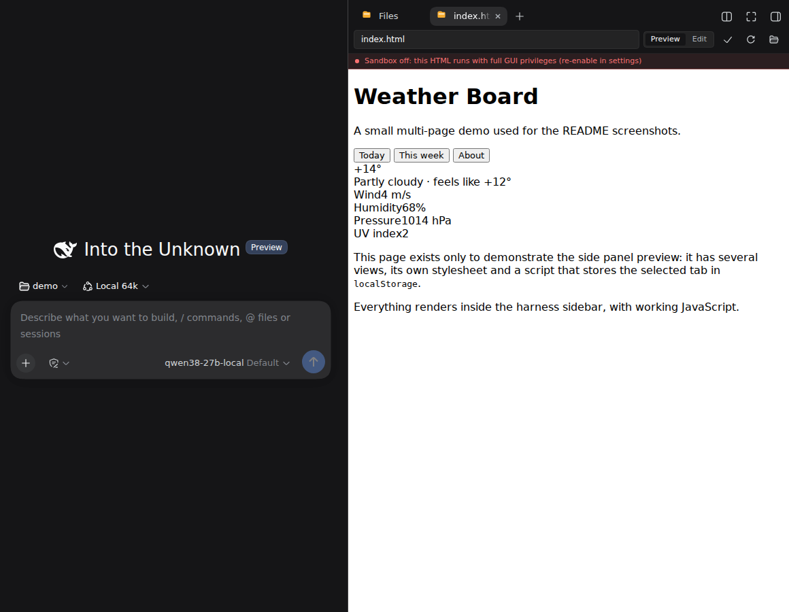

# DeepSeek Harness: full setup from scratch, with plugins and tuning

**[Русская версия](README.ru.md)**

This repository installs a complete [DeepSeek Harness](https://github.com/deepseek-ai/deepseek-harness)
stand on a Windows PC: a local model on your own GPU, a coding agent that reads and edits
your project files, a side panel that renders the result (HTML pages, PDFs, spreadsheets),
and a mobile interface you can actually use from a phone.

It is not a bare harness install. It also sets up the plugins worth having, applies 17
patch layers that fix what does not work out of the box (most of them on the mobile side),
tunes the model server for your GPU, and installs shortcuts, an update button and a full
uninstall.

Everything runs locally. Nothing is sent to a cloud.

<p align="center">
  
  
</p>

---

## Requirements

| | Minimum | Tuned for |
|---|---|---|
| OS | Windows 10 / 11 | Windows 11 |
| GPU | NVIDIA, 12 GB VRAM | RTX 5080, 16 GB |
| Disk | 40 GB free | |
| RAM | 16 GB | 32 GB |

The configuration in this repository is tuned for an **RTX 5080 with 16 GB**, running
Qwen3.8 27B at UD-Q3_K_XL. With less video memory the installer picks a smaller model
from the same catalog — at 12 GB that is **Qwen3.5 9B (MTP build)**, which supports the
same speculative decoding the stand relies on for speed. If even that does not fit, the
wizard suggests a lower quantization of the same file rather than a different model.

Without an NVIDIA GPU the stand still installs — the installer picks a CPU build of the
engine — but the model then runs tens of times slower.

**Things you do *not* have to prepare:**

- **WSL.** If it is missing, `00-prereqs` installs WSL2 and a distribution for you.
  Windows may ask for a reboot; after it, run the installer again and it continues.
- **A drive named F:.** That is only the default in `config.example.json`. If that drive
  does not exist, the installer picks the drive with the most free space and writes the
  choice back into `config.json`.
- **CUDA Toolkit.** Only the NVIDIA display driver is needed: the engine ships as a
  prebuilt binary together with the matching CUDA runtime libraries, which the installer
  downloads for you. The Toolkit is required only if you choose to build llama.cpp from
  source with `10-llama.ps1 -Build`.
- **A specific CUDA version.** The installer reads what your driver supports and picks
  the newest engine build that fits.

## Install

1. Download this repository (**Code → Download ZIP**) and unpack it.
2. Copy `config.example.json` to `config.json`. You only need to look at one line —
   `windowsRoot`, the folder for the model and the engine.
3. Right-click **install.cmd** → **Run as administrator**.

The installer explains every step as it goes:

| Step | What happens |
|---|---|
| `00-prereqs` | checks GPU and free space, installs WSL2 and a distribution, opens the model port |
| `10-llama` | installs llama.cpp with the CUDA build matching your driver |
| `20-model` | picks a model for your GPU and downloads it |
| `wsl/*` | builds the harness, installs plugins, applies 17 patch layers, writes the config |
| `30-tune` | computes the context window that fits your VRAM and measures the result |
| `40-shortcuts` | shortcuts, autostart, power-maintenance task |
| `50-verify` | verifies everything came up |

Every step is idempotent — an interrupted install can simply be started again. A single
step can be run on its own:

```powershell
powershell -ExecutionPolicy Bypass -File install.ps1 -Step model
```

Which versions get installed is fixed in [`stand.lock.json`](stand.lock.json): the harness
tag, every plugin version and the list of patch layers. That is the combination this
repository was tested with, which is why the installer does not chase "latest".

### About the model

Choosing a model, knowing where to put it and tuning the server afterwards is where people
usually get stuck. `windows\20-model.ps1` reads your VRAM, shows which models fit and
downloads the one you pick; `windows\30-tune.ps1` then computes the context window, writes
the launch command and the agent preset and measures prefill and generation speed.

The same thing in words — [docs/MODEL.md](docs/MODEL.md).

## Daily use

- **Harness AI** on the desktop starts the model and the interface.
- Interface: <http://127.0.0.1:3080>.
- From a phone — over a Cloudflare Tunnel, enabled in `config.json`; details in
  [docs/MOBILE.md](docs/MOBILE.md).

**Stopping the stand: the power button in the top-left corner of the interface.** It works
from the PC and from the phone, and offers four levels — stop the stand only, stop it
together with WSL, stop and sleep, stop and shut the PC down.

<p align="center">
  
</p>

The desktop shortcut **Harness AI — stop** does the same as the first option.

### While the stand is running

The PC **does not go to sleep** — that would cut the agent off mid-task, because CPU and
GPU load does not count as activity for Windows; it waits for keyboard input. The screen
still turns off on the usual idle timeout, which changes nothing: the stand keeps working
and a phone session is unaffected. When you stop the stand, the previous sleep settings
are restored exactly as they were.

To see the current state:

```powershell
powershell -ExecutionPolicy Bypass -File F:\Harness_AI\run\harness-idle-sleep.ps1
```

## Updating

```
update.cmd
```

It pulls the new version of this repository, backs up your profile, applies
`stand.lock.json` (harness, plugins, patch layers, settings), restarts the stand and
verifies it. The backup is made before anything changes, and the command prints how to
roll back.

## Uninstall

```
uninstall.cmd
```

It asks for confirmation and lists what will be removed before doing anything.

| Command | What it removes |
|---|---|
| `uninstall.cmd` | shortcuts, scheduled task, firewall rule, engine, launch scripts, models, and the stand's data inside WSL |
| `uninstall.cmd -KeepModel` | the same, but the downloaded models stay (they take a long time to fetch again) |
| `uninstall.cmd -KeepData` | the same, but your chats, agent memory and settings stay |
| `uninstall.cmd -All` | **everything, down to zero**: the above plus the whole WSL distribution |
| `bash wsl/uninstall.sh` | only the Linux side, from inside WSL |

`-All` also removes the WSL distribution, so anything else you kept inside it goes too —
it asks you to type the distribution name to confirm. Windows itself, WSL as a system
component and the GPU driver are never touched.

## What gets installed

- **DeepSeek Harness** at the tag from `stand.lock.json`, built from source inside WSL2.
- **Plugins** at pinned versions: mobile bridge, side panel with a file explorer and
  viewers, office documents, context meter, graph memory, turn rewind.
- **17 patch layers** — our own fixes on top of the harness and the plugins (below).
- **llama.cpp** plus the GGUF model you chose, on the Windows side.

<p align="center">
  
</p>

### Why the patch layers

Out of the box the harness plus plugins work poorly on a phone, and some things do not
work at all. Each layer is a separate script identified by a marker inside the patched
file, so a plugin update cannot silently lose it: `scripts/ensure-patches.sh` re-applies
whatever is missing on every start.

| Layer | What it gives you |
|---|---|
| bridge (translation + 11 fixes) | a usable mobile UI: drawer, rotation, splash screen, power button |
| mobile-ux | the model's question card no longer covers the chat, folds into a strip, and cannot be dismissed by accident; no blue tap flash |
| preview-zoom | pinch zooms the *content* of the preview — page, PDF, table — not the panel itself, and the zoomed page can be panned |
| zoom-scope | pinch does not zoom the conversation while typing |
| pdfjs-map-polyfill | PDFs open in browsers older than Chrome 140 (pdf.js 6.3 calls a very new `Map` method) |
| html-no-store | the app page is never cached, so a phone cannot get stuck on an old bundle |
| session-sync | clicking a file in the side panel opens it (broken outright on harness 0.1.6) |
| relative-path | a file link in the chat opens the same way as from the explorer |
| binary-handoff | PDFs and office files open in the panel instead of being downloaded |
| turnTail slot id | side panel and office plugin stay compatible with harness 0.1.6 |
| better-sidebar preview | multi-page apps preview with working JavaScript |
| llm-pi-ai usage | the model stops truncating answers based on a wrong length estimate |
| graph-memory scope | agent memory does not mix projects |
| ui-conversation eager read | a pasted screenshot actually reaches the model |

## Housekeeping

The agent keeps per-turn file snapshots (what the panel shows as changes) in
`~/.dsh/change-ledger`, outside your projects — it never lands in a git repository, but it
does grow. Both that and the rest of the stand's leftovers are cleaned by:

```bash
bash ~/Harness_AI/scripts/dsh-cleanup.sh                 # report only
bash ~/Harness_AI/scripts/dsh-cleanup.sh --apply --ledger-days 30
```

If you want to put a project under git, give its folder a `.gitignore` for the files the
agent creates beside your code (screenshots, backups, exports):

```bash
bash ~/Harness_AI/scripts/project-gitignore.sh --all
```

## Web access and your own GPU work

**Reading pages (`web_fetch`) works out of the box** — the agent opens a link and
reads it, no keys involved. The tool is part of the preset's resident set:
anything outside that set does not exist for the model, so registering the plugin
alone is not enough. Private addresses (`127.0.0.1`, your home network) are
refused by design, so a page cannot be used to reach a local service of yours.

**Search (`web_search`) needs a provider.** In the harness bundle search goes to
DeepSeek and takes its key from `DEEPSEEK_API_KEY`
(`packages/bundle/base/cordis.patch.yml:461`); a local model exposes no such
endpoint. Without a key search returns an error while page reading keeps working.
Either set a DeepSeek, Exa or Perplexity key (Settings → search), or just hand
the agent links yourself — it will read them. As soon as a key is present in the
environment, the preset adds `web_search` to the model's set by itself.

**The agent does not run code silently.** The default is `workspace-write` with
confirmation: the command is shown to you before it runs, and file writes are
confined to the workspace (`packages/bundle/base/cordis.patch.yml:231`). The
sandbox governs file effects only — network and process launches are not
restricted, so `pip install`, dataset downloads and training all work.

**There is only one GPU.** By default the tuning wizard gives the model almost
the whole card: 150–500 MiB stay free. Training a network — a CNN, a diffusion
model — will not fit into that and dies with `CUDA out of memory`. Your job and
the model share one card, so the split is decided up front:

```powershell
# keep 6 GB free for your own work; the context window is computed from the rest
powershell -ExecutionPolicy Bypass -File windows\30-tune.ps1 -ReserveMb 6000
```

The agent knows this by itself: the first CUDA training launch is not executed
but answered with the measurement — how much VRAM is free, how much the model
holds — and the same three ways out, so instead of an OOM traceback minutes later
you get the explanation at once. After that the plugin stays out of the way: once
you have freed the card, or if you want to try anyway, the next launch runs.

On 16 GB a sensible split is Qwen3.5 9B (about 7 GB) plus 6–8 GB for training.
If you need the large model instead, the other route is to stop the model server
while you compute (`run\stop-server.ps1`) — the agent is then headless until you
start it again. The GPU is visible from WSL (`nvidia-smi` lives in
`/usr/lib/wsl/lib`) and CUDA PyTorch wheels install with `pip`; no CUDA Toolkit
is required for that.

**About the preview sandbox.** So that multi-page apps render with working
JavaScript, the settings ship `htmlViewerNoSandbox: true`
(`templates/settings.yaml.tmpl`). The cost is stated there: a previewed page runs
with the interface's origin and can read and write session files. That is what
you want for your own projects; do not open someone else's HTML that way.

## Troubleshooting

**The phone shows 530 over the tunnel.** Cloudflare Tunnel needs outbound TCP 7844. Some
networks block it, and then nothing helps until you switch network or turn on a VPN. Plain
HTTPS keeps working, which makes this easy to misdiagnose — see [docs/MOBILE.md](docs/MOBILE.md).

**Generation is slower than ~20 tokens/s.** The model did not fit into VRAM. Re-run
`windows\30-tune.ps1` (it recomputes the window) or pick a smaller quantization — see
[docs/MODEL.md](docs/MODEL.md).

**The first request after start is slow.** Expected: the first large prompt runs on a cold
file cache and unbuilt CUDA graphs. The launcher sends a warm-up request, so this only
shows up if you start the server by hand.

## Licensing

This repository contains **our own code**: install and uninstall scripts, patch layers,
config templates, documentation. It does not redistribute the harness or the plugins —
`pnpm` fetches them from the official registry during installation, and the patches are
applied locally on your machine afterwards. The one exception is the UI translation
dictionary for the bridge plugin (strings extracted from its MIT-licensed source plus our
English translations); without it the English UI cannot be re-applied after a plugin
update. The licenses of all upstream projects (MIT, Apache-2.0, BSD-3-Clause) and what
exactly we change are listed in [NOTICE](NOTICE).

Our own code is MIT — see [LICENSE](LICENSE).
