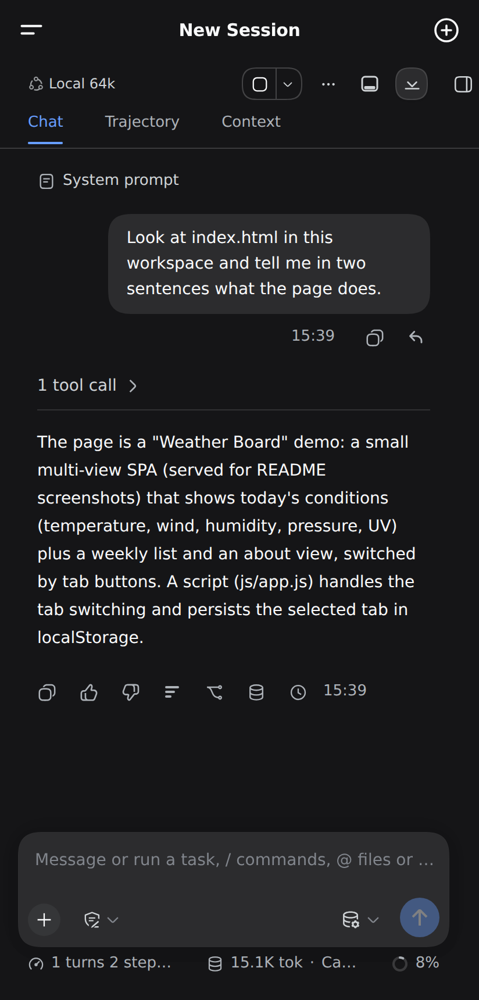
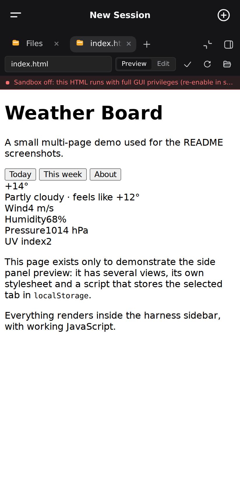
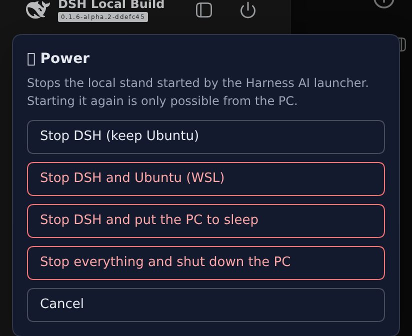
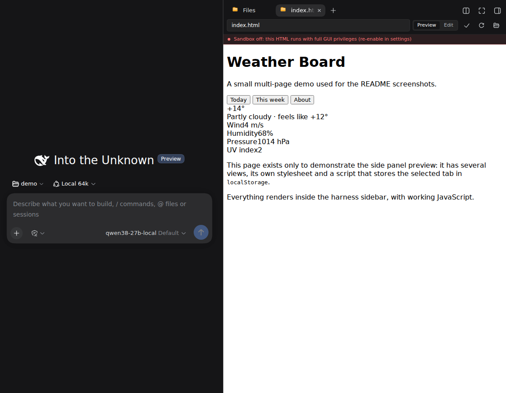

# DeepSeek Harness: полная установка с нуля, с плагинами и настройкой

**[English version](README.md)**

Репозиторий ставит на компьютер с Windows готовый стенд
[DeepSeek Harness](https://github.com/deepseek-ai/deepseek-harness): модель на вашей
видеокарте, агент, который читает и правит файлы проекта, боковая панель с показом
результата (HTML-страницы, PDF, таблицы) и мобильный интерфейс, которым действительно
можно пользоваться с телефона.

Это не «голая» установка харнеса. Здесь же ставятся плагины, которые имеет смысл иметь,
накладываются 24 патч-слоя, чинящих то, что из коробки не работает (большинство — про
мобильную версию), сервер модели настраивается под вашу видеокарту, а к этому идут ярлыки,
кнопка обновления и полное удаление.

Всё считается локально, наружу ничего не уходит.

## Что это такое

Это не набор советов и не список команд, которые нужно выполнить самому. Это **установка
под ключ**: вы копируете `config.json`, запускаете `install.cmd` от администратора и
получаете рабочую систему, в которой уже всё сведено друг с другом.

Что входит:

- **модель на вашей видеокарте** — установщик сам подберёт её под объём видеопамяти,
  скачает, посчитает окно контекста и проверит скорость замером;
- **агент, который работает с файлами** — читает проект, правит код, запускает команды с
  вашего подтверждения, помнит решения между сессиями;
- **боковая панель** — проводник, редактор, просмотр результата: HTML-страницы с
  работающим JavaScript, PDF, таблицы, диффы и коммиты по git;
- **телефон** — интерфейс, которым правда можно пользоваться с телефона, и доступ из любой
  точки через туннель;
- **обслуживание** — ярлыки, кнопка выключения, обновление одной командой, полное удаление,
  уборка накопившегося.

Почему это не то же самое, что «поставить харнес самому»: сам по себе харнес — это ядро.
Вокруг него приходится выбирать и связывать плагины, чинить то, что на телефоне не работает,
подбирать модель под карту, считать окно контекста, настраивать запуск, туннель, питание.
Здесь это уже сделано и зафиксировано: **24 патч-слоя** на месте поломок, версии всех
компонентов записаны в `stand.lock.json`, а настройки сервера модели считаются под вашу
видеокарту, а не берутся из чужого примера.

Честно о границах: нужна видеокарта NVIDIA (стенд заводится от 6 ГБ, комфортно — от 12) и Windows с WSL2; качество ответов —
это качество выбранной модели, а не установщика; видеокарта одна, поэтому свои задачи на
GPU (обучение сетей) и модель делят её по очереди — про это есть
[отдельный раздел](#поиск-в-интернете-и-свои-задачи-на-видеокарте).

<p align="center">
  
  
</p>

---

## Что нужно

| | Минимум | Под что настроено |
|---|---|---|
| Система | Windows 10 / 11 | Windows 11 |
| Видеокарта | NVIDIA, 8 ГБ (комфортно с 12) | RTX 5080, 16 ГБ |
| Место на диске | 40 ГБ | |
| Оперативная память | 16 ГБ | 32 ГБ |

Конфигурация в репозитории настроена под **RTX 5080 с 16 ГБ** и модель Qwen3.8 27B в
кванте UD-Q3_K_XL. Если видеопамяти меньше, установщик берёт модель поменьше из того же
каталога: на 12 ГБ это **Qwen3.5 9B (сборка MTP)** — она поддерживает то же спекулятивное
декодирование, на котором держится скорость стенда. Если не влезает и она, мастер
предлагает тот же файл в кванте помельче, а не другую модель.

Без видеокарты NVIDIA стенд тоже установится — установщик возьмёт сборку движка под
процессор, — но модель будет работать в десятки раз медленнее.

**Чего готовить заранее НЕ нужно:**

- **WSL.** Если его нет, шаг `00-prereqs` сам поставит WSL2 и дистрибутив. Windows может
  попросить перезагрузку; после неё запустите установщик снова — он продолжит с того же места.
- **Диска именно F:.** Это умолчание из `config.example.json`. Если такого диска нет,
  установщик возьмёт диск с наибольшим свободным местом и запишет выбор в `config.json`.
- **CUDA Toolkit.** Нужен только драйвер NVIDIA: движок ставится готовой сборкой вместе с
  подходящими библиотеками времени выполнения CUDA, их установщик качает сам. Toolkit
  нужен, только если вы захотите собрать llama.cpp из исходников (`10-llama.ps1 -Build`).
- **Конкретной версии CUDA.** Установщик смотрит, что поддерживает драйвер, и берёт самую
  свежую подходящую сборку.

## Установка

### 1. Скачать и распаковать

**Code → Download ZIP**, распаковать в обычную папку — например `C:\harness-setup`.
Не запускайте прямо из архива: скрипты ищут файлы рядом с собой.

Запускать нужно только то, что лежит в корне распакованной папки, — там ровно три
файла: `install.cmd`, `update.cmd` и `uninstall.cmd`. Всё остальное внутри папок,
туда заходить не нужно.

> **Windows будет ругаться, и это ожидаемо.** SmartScreen покажет «Windows защитила ваш
> компьютер», антивирус может подсветить установщик. Причина простая: это неподписанные
> PowerShell-скрипты, которые качают исполняемые файлы из интернета — ровно тот профиль
> поведения, на который срабатывает эвристика. Подписи у репозитория нет.
> В окне SmartScreen: **Подробнее → Выполнить в любом случае**. Если антивирус удалил
> файлы, добавьте папку в исключения и распакуйте заново. Что именно качается, видно в
> [`stand.lock.json`](stand.lock.json) и в тексте скриптов.

### 2. Настроить config.json

**Просто откройте `config.example.json` и правьте его.** Ничего копировать и
переименовывать не нужно: `config.json` установщик создаст из примера сам при первом
запуске, вместе с вашими правками.

Так надёжнее, чем создавать файл вручную. В Windows проводник по умолчанию прячет
расширения, и «Создать → Текстовый документ» даёт `config.json.txt`, который выглядит
правильно и не работает.

Смотреть там нужно на одну строку — `windowsRoot`, куда положить модель и движок.
Нужно **40 ГБ свободного места**; саму папку создавать заранее не надо, установщик
сделает это сам.

```json
"windowsRoot": "D:/Harness_AI",
```

**Главная ловушка — обратные слэши.** Проводник в адресной строке даёт путь вида
`D:\Harness_AI`, и вставить его как есть нельзя: это JSON, в нём обратный слэш
служебный. `"D:\Harness_AI"` — сломанный файл, установщик до вас не дойдёт.
Пишите через прямой слэш — он работает так же, и его нельзя испортить:

| Так работает | Так не работает |
|---|---|
| `"D:/Harness_AI"` | `"D:\Harness_AI"` — путь из проводника как есть |
| `"D:\\Harness_AI"` | `"D:/Harness AI"` — пробел лучше не ставить |

Запятая в конце строки обязательна — она уже там, не удалите её.

Проверить файл, не запуская установку целиком. Откройте папку с `install.cmd` в
проводнике, щёлкните в адресной строке, наберите `powershell` и Enter — консоль
откроется уже в нужном месте. Затем одной строкой:

```powershell
try { Get-Content .\config.example.json -Raw -EA Stop | ConvertFrom-Json -EA Stop | Out-Null; 'OK' } catch { "ОШИБКА: $($_.Exception.Message)" }
```

`OK` — можно запускать установку. Иначе на экране будет причина.

Строки, начинающиеся с `_`, — это пояснения. Их можно не трогать.
Если диска из `windowsRoot` на машине нет, установщик сам возьмёт диск с наибольшим
свободным местом и запишет выбор обратно в `config.json`.

### 3. Запустить

Правый клик по **install.cmd** → **Запуск от имени администратора**.

**Если WSL ещё не стоял**, установка пройдёт в три захода — это нормально и так задумано:

| Заход | Что происходит | Что делать вам |
|---|---|---|
| 1-й | ставится WSL2, установщик предлагает перезагрузку | нажать `R` и Enter — перезагрузится сам, а после входа в систему продолжит установку (один раз спросит права администратора) |
| 2-й | ставится Ubuntu, открывается чёрное окно и просит придумать имя пользователя и пароль | ввести любое имя латиницей и пароль (**при вводе пароля символы не печатаются — это не зависание**), затем закрыть это окно и запустить `install.cmd` снова |
| 3-й | идёт установка целиком | ждать |

Пароль этот — от пользователя внутри Ubuntu, он нужен редко; запишите его.
После второго захода окно остаётся с приглашением вида `myros@MSI:/mnt/c/...$` —
это не ошибка и не вопрос к вам, просто закройте окно.

Дальше установщик всё делает сам и по ходу рассказывает, что происходит:

| Шаг | Что делает |
|---|---|
| `00-prereqs` | проверяет видеокарту и место, ставит WSL2 и дистрибутив, открывает порт модели |
| `10-llama` | ставит llama.cpp со сборкой CUDA под ваш драйвер |
| `20-model` | подбирает модель под видеокарту и скачивает её |
| `wsl/*` | собирает харнес, ставит плагины, накладывает 24 патч-слоя, пишет настройки |
| `30-tune` | считает окно контекста под видеопамять и делает контрольный замер |
| `40-shortcuts` | ярлыки, автозапуск, задача обслуживания питания |
| `50-verify` | проверяет, что всё поднялось |

**Язык сообщений.** По умолчанию установщик и лончер говорят по-английски. Переключить на
русский — строка `"lang": "ru"` в `config.json` или переменная окружения на один запуск:

```powershell
$env:HARNESS_LANG = 'ru'
```

Переводы лежат в `i18n/ru.json` — обычная таблица «английская строка → перевод». Строка,
которой в таблице нет, печатается по-английски, поэтому неполный перевод ничего не ломает.

**Установщик останавливается на первой упавшей ошибке** и говорит, какой шаг упал и как
перезапустить только его. Всё, что после — не выполняется: продолжать поверх сломанного
шага бессмысленно, а его сообщение всё равно утонуло бы в следующих экранах.

Каждый шаг идемпотентен — прерванную установку можно запустить заново, уже сделанное
пропускается.

### Как передать флаг

`install.cmd` передаёт свои аргументы дальше, но двойным кликом и через «Запуск от имени
администратора» аргументы задать негде. Поэтому так: **Пуск → cmd → правый клик → Запуск
от имени администратора**, и оттуда:

```
cd /d C:\harness-setup
install.cmd -Step model
```

То же самое работает для `uninstall.cmd -All` и `update.cmd`.

| Флаг `install.cmd` | Что делает |
|---|---|
| `-Step <имя>` | выполнить один шаг: `prereqs`, `llama`, `wsl`, `model`, `tune`, `shortcuts`, `verify` |
| `-SkipModel` | не трогать модель (уже скачана и настроена) |
| `-SkipLlama` | пропустить движок llama.cpp |

Отдельные флаги есть и у самих шагов, они полезны, когда что-то не завелось:

| Команда | Когда нужна |
|---|---|
| `powershell -File windows\10-llama.ps1 -Cpu` | видеокарта или драйвер не тянут: сборка под процессор, медленно, но работает везде |
| `powershell -File windows\20-model.ps1 -ListOnly` | посмотреть, что влезает в вашу видеопамять, ничего не качая |
| `powershell -File windows\20-model.ps1 -Model <имя файла>` | взять конкретный квант вместо подобранного |
| `powershell -File windows\20-model.ps1 -NoDownload` | записать выбор в конфиг, файл положить руками |

Какие именно версии ставятся, зафиксировано в [`stand.lock.json`](stand.lock.json): тег
харнеса, версии всех плагинов и список патч-слоёв. Это связка, на которой репозиторий
проверен, — поэтому установщик не гонится за «самым свежим».

### Про модель

Выбор модели, куда её класть и как потом настроить сервер — место, где обычно всё и
застревает. `windows\20-model.ps1` читает объём видеопамяти, показывает, что влезает, и
качает выбранное; `windows\30-tune.ps1` затем считает окно контекста, пишет команду
запуска и пресет агента и делает замер скорости.

То же самое словами — [docs/MODEL.ru.md](docs/MODEL.ru.md).

## Как пользоваться

- Ярлык **Harness AI** на рабочем столе поднимает модель и интерфейс.
- Интерфейс: <http://127.0.0.1:3080>.
- С телефона — три способа: домашняя сеть по QR-коду, временный туннель (адрес выдаётся
  сразу, аккаунт Cloudflare не нужен) и постоянный домен. Перед выходом наружу задайте
  пароль доступа — через мобильный интерфейс доступен агент, который правит файлы на
  компьютере. Пошагово: [docs/MOBILE.ru.md](docs/MOBILE.ru.md).

**Выключается стенд кнопкой питания в левом верхнем углу интерфейса.** Она работает и с
компьютера, и с телефона, и предлагает четыре варианта: остановить только стенд,
остановить вместе с WSL, остановить и усыпить компьютер, остановить и выключить компьютер.

<p align="center">
  
</p>

Ярлык **Harness AI — стоп** на рабочем столе делает то же, что первый вариант.

### Пока стенд работает

Компьютер **не уходит в сон** — иначе работа агента обрывалась бы на середине: нагрузка на
процессор и видеокарту простоем не считается, Windows ждёт ввода с клавиатуры. Экран при
этом гаснет по обычному таймауту, и это ничего не меняет: стенд продолжает работать, на
сеанс с телефона это не влияет. При остановке стенда прежние настройки сна возвращаются
ровно такими, какими были.

Посмотреть текущее состояние:

```powershell
powershell -ExecutionPolicy Bypass -File F:\Harness_AI\run\harness-idle-sleep.ps1
```

## Обновление

```
update.cmd
```

Забирает новую версию репозитория, снимает бэкап профиля, применяет `stand.lock.json`
(харнес, плагины, патч-слои, настройки), перезапускает стенд и проверяет его. Бэкап
делается до изменений, а команда печатает, чем откатиться.

## Удаление

Двойной клик по `uninstall.cmd` — флаги задавать не нужно, он сам спросит, как удалять:

```
  Как удалять:
    1   стенд; сам дистрибутив WSL остаётся
    2   то же, но скачанные модели остаются
    3   то же, но остаются переписки, память агента и настройки
    4   всё под ноль: стенд, дистрибутив WSL и сам WSL
        2 и 3 можно совместить: наберите 23
```

После выбора он покажет список того, что уйдёт, и попросит подтвердить — набрать
слово `delete` (в русском интерфейсе — `удалить`). Пустой ответ на первый вопрос
означает вариант 1.

Вариант 4 сносит дистрибутив WSL целиком, а с ним и всё, что в нём лежало помимо
стенда. Саму Windows, WSL как компонент системы и драйвер видеокарты удаление не
трогает ни в одном режиме.

Вариант 4 убирает и сам WSL — его ставил наш установщик, значит полное удаление
должно его и снять. Но только если он больше никому не нужен: список дистрибутивов
перечитывается уже после удаления нашего, и если там осталось что-то чужое
(например, `docker-desktop`), WSL остаётся, а удаление скажет почему. Оставить WSL
намеренно: `uninstall.cmd -All -KeepWsl`.

Компоненты Windows «Платформа виртуальной машины» и «Подсистема Windows для Linux»
остаются включёнными в любом случае. Сами по себе они ничего не делают, а выключение
может сломать Hyper-V или Docker, поэтому это оставлено ручным шагом.

**Если WSL вы оставили, папка «Linux» в проводнике никуда не денется — это нормально.**
Она принадлежит самому WSL и висит там даже при нуле дистрибутивов; внутри будет пусто.

Те же варианты есть флагами — они нужны скриптам, где спросить некого:
`-KeepModel`, `-KeepData`, `-All`, `-Yes` (не спрашивать вообще). Если флаг задан,
меню не показывается. Только линуксовую часть, изнутри WSL, убирает
`bash wsl/uninstall.sh`.

## Что именно ставится

- **DeepSeek Harness** с тегом из `stand.lock.json`, собирается из исходников внутри WSL2.
- **Плагины** фиксированных версий: мобильный мост, боковая панель с проводником и
  просмотрщиками, офисные документы, счётчик контекста, память-граф, откат хода.
- **24 патч-слоя** — мои доработки поверх харнеса и плагинов (ниже).
- **llama.cpp** и выбранная модель GGUF на стороне Windows.

<p align="center">
  
</p>

### Зачем патч-слои

Из коробки связка «харнес + плагины» на телефоне работает плохо, а часть вещей не работает
вовсе. Каждый слой — отдельный скрипт, который узнаётся по маркеру внутри пропатченного
файла, поэтому обновление плагина не может тихо его потерять: `scripts/ensure-patches.sh`
переприменяет недостающее при каждом запуске.

| Слой | Что даёт |
|---|---|
| bridge (перевод + 11 правок) | пригодный мобильный интерфейс: шторка, поворот, экран загрузки, кнопка питания |
| mobile-ux | окно вопросов модели не перекрывает переписку, сворачивается в полоску и не закрывается случайно; нет синей вспышки при нажатии |
| preview-zoom | щипок масштабирует *содержимое* просмотра — страницу, PDF, таблицу, — а не саму панель, и увеличенную страницу можно возить пальцем |
| zoom-scope | щипок не масштабирует переписку при наборе |
| pdfjs-map-polyfill | PDF открывается в браузерах старее Chrome 140 (pdf.js 6.3 зовёт совсем новый метод `Map`) |
| html-no-store | страница приложения не кешируется, и телефон не застревает на старом бандле |
| session-sync | клик по файлу в боковой панели открывает файл (на харнесе 0.1.6 не работал совсем) |
| relative-path | ссылка на файл из переписки открывается так же, как из проводника |
| binary-handoff | PDF и офисные файлы открываются в панели, а не скачиваются |
| turnTail slot id | боковая панель и офисный плагин остаются совместимы с харнесом 0.1.6 |
| better-sidebar preview | предпросмотр многостраничных приложений с работающим JavaScript |
| llm-pi-ai usage | модель перестаёт обрезать ответ по ошибочной оценке длины |
| graph-memory scope | память агента не смешивает проекты |
| ui-conversation eager read | вставленный скриншот действительно доходит до модели |
| touch-ui-gate | сенсорные исправления работают и на планшете, а не только уже 768 px |
| mobile-attach | кнопка вложения в одно касание на сенсорной строке ввода и рядом — кнопка фото |
| mobile-back | системный жест «назад» закрывает шторку, панель или диалог, а не выходит из приложения |
| load-monitor | загрузка, температура, потребление видеокарты и израсходованная с запуска энергия — в шапке |
| fs-edit-tolerant | правка, чей `old_string` отличается только пробелами, всё равно применяется; если совпадения действительно нет, ошибка цитирует файл |
| fs-missing-path | запись или правка по несуществующему пути так и говорит, вместо «файл не прочитан» про файл, которого нет |
| mobile-input | на сенсорном экране Enter переносит строку, а не отправляет; буфер обмена с одним только HTML всё равно вставляется; длинный вопрос оставляет место ответам |
| write-streak-notice (пресет) | говорит, когда ход идёт долго и ничего не записано, до того как ответ упрётся в потолок |

## Порядок в файлах

Агент хранит снимки файлов по ходам (то, что панель показывает как изменения) в
`~/.dsh/change-ledger` — вне ваших проектов: в репозиторий git это не попадает, но место
занимает и растёт. И это, и остальные следы работы убираются так:

```bash
bash ~/Harness_AI/scripts/dsh-cleanup.sh                 # только отчёт
bash ~/Harness_AI/scripts/dsh-cleanup.sh --apply --ledger-days 30
```

Если проект хочется положить в git, дайте его папке `.gitignore` под то, что агент создаёт
рядом с вашим кодом (снимки экрана, копии перед правкой, выгрузки):

```bash
bash ~/Harness_AI/scripts/project-gitignore.sh --all
```

## Поиск в интернете и свои задачи на видеокарте

**Чтение страниц (`web_fetch`) работает сразу** — агент открывает ссылку и читает
её сам, ключи не нужны. Инструмент входит в резидентный набор пресета: то, чего
в этом наборе нет, для модели не существует, поэтому одной регистрации плагина
мало. Частные адреса (`127.0.0.1`, домашняя сеть) он открывать отказывается —
это защита от того, чтобы страницей нельзя было дотянуться до вашей локальной
службы.

**Поиску (`web_search`) нужен провайдер.** В сборке харнеса поиск ходит в
DeepSeek и берёт ключ из `DEEPSEEK_API_KEY`
(`packages/bundle/base/cordis.patch.yml:461`); локальная модель такого эндпоинта
не даёт. Без ключа поиск будет отвечать ошибкой, а чтение страниц — работать.
Варианты: задать ключ DeepSeek, Exa или Perplexity (Настройки → поиск), либо
давать агенту ссылки самому — он их прочитает. Как только ключ появляется в
окружении, пресет добавляет `web_search` в набор модели сам.

**Exa как поисковик.** Штатный `web_search` ходит в DeepSeek, а тому нужен
пополненный баланс. Exa — бесплатная замена: $10 кредитов, возобновляются
первого числа каждого месяца, карта не нужна. Провайдер к харнесу приложен, но
в зависимостях базового бандла его нет, поэтому нужно три вещи: ключ в
Настройки → Плагины → Web search (он ложится в `~/.dsh/.credentials.yaml`, а не
в публикуемый файл), ряд `web-search-exa`, вставленный в патч профиля, и
`searchProvider: exa` у ряда `web`, плюс симлинки, которые держит
`scripts/ensure-patches.sh` (`link_pkg`). `start-web.sh` поднимает сохранённый
ключ в окружение — пресет агента решает по нему, делать ли `web_search`
резидентным.

**Код агент не запускает молча.** Режим по умолчанию — `workspace-write` с
подтверждением: команда показывается вам до выполнения, а запись файлов
разрешена только внутри рабочей области
(`packages/bundle/base/cordis.patch.yml:231`). Сеть и запуск процессов песочница
не ограничивает — `pip install`, скачивание датасета и обучение проходят.

**Видеопамять одна на всех.** Мастер настройки по умолчанию отдаёт модели почти
всю карту: после запуска свободно 150–500 МиБ. Обучение сети (хоть CNN, хоть
диффузия) в такой остаток не влезет — придёт `CUDA out of memory`. Ваша задача
и модель делят одну карту, поэтому выбирать нужно заранее:

```powershell
# оставить 6 ГБ свободными под свои задачи, окно контекста посчитать из остатка
powershell -ExecutionPolicy Bypass -File windows\30-tune.ps1 -ReserveMb 6000
```

**Обучение запускаете вы, а готовит его агент.** Из своей оболочки агент до
видеокарты не дотянется вовсе: песочница даёт ему пустой `/dev` без устройства
GPU, поэтому `nvidia-smi` отвечает там «GPU access blocked». Поэтому правила
агента (`~/.dsh/AGENTS.md`, ставится установщиком) говорят ему делать то, что
не заблокировано, и передавать запуск вам: довести скрипт, конвейер данных и
конфиг; доказать, что код работает, коротким прогоном на процессоре; и оставить
в проекте файл `RUN-TRAINING.md` — инструкцию, по которой вы запускаете сами:
как освободить карту, как поставить окружение, команда запуска, чем следить и
как вернуть стенд обратно. Если он всё-таки попробует запустить обучение сам,
первый такой вызов не выполняется, а возвращает измерение — сколько памяти
свободно и сколько держит модель.

На 16 ГБ разумная связка — модель Qwen3.5 9B (около 7 ГБ) плюс 6–8 ГБ под
обучение. Если модель нужна большая, второй путь — остановить сервер модели на
время счёта (`run\stop-server.ps1`), но тогда агент на это время без головы.
GPU из WSL виден (`nvidia-smi` лежит в `/usr/lib/wsl/lib`), колёса PyTorch с
CUDA ставятся через `pip` — CUDA Toolkit для этого не нужен.

**Про песочницу предпросмотра.** Чтобы многостраничные приложения открывались с
работающим JavaScript, в настройках стоит `htmlViewerNoSandbox: true`
(`templates/settings.yaml.tmpl`). Цена названа там же: страница в предпросмотре
исполняется с origin интерфейса и может читать и писать файлы сессии. Для своих
проектов это то, что нужно; открывать так чужой HTML не стоит.

## Git: как держать проект в порядке

Агент оставляет рядом с работой три разные вещи, и путать их не стоит.

**Снимки ходов** — то, что панель показывает как изменения. Лежат в
`~/.dsh/change-ledger`, вне ваших проектов, в git не попадают никогда. Растут:
на этом стенде за неделю — больше сотни гигабайтных снимков файлов. Чистятся
`dsh-cleanup.sh --apply --ledger-days 30`.

**Точки отката** — плагин `turn-rewind` кладёт их **внутрь того репозитория,
где лежит проект**, в ссылки `refs/dsh-turn-rewind/…`. Это не ветки: `git
branch` их не покажет и обычный `git push` не отправит, но многие интерфейсы
выводят их рядом с ветками — отсюда ощущение, что веток сотни. Посмотреть и
почистить:

```bash
bash ~/Harness_AI/scripts/git-rewind-refs.sh ~/путь/к/проекту            # сколько их
bash ~/Harness_AI/scripts/git-rewind-refs.sh ~/путь/к/проекту --days 14  # удалить старые
```

Удалённая точка означает, что откатить тот ход больше нельзя, — поэтому по
умолчанию скрипт ничего не трогает.

**Рабочий мусор** — `.shots/` (снимки экрана), `backups/` (копии перед правкой),
`out/`, логи. Это единственное, что реально попало бы в коммит.

### Подключить проект к GitHub

```bash
bash ~/Harness_AI/scripts/project-git-init.sh ~/Harness_AI/projects/Cooking_APP
```

Скрипт разложит `.gitignore`, заведёт репозиторий с веткой `main`, **покажет,
что именно попадёт в коммит и сколько это весит** (на упомянутом проекте: 6 МБ
на диске → 815 КБ в коммите, 108 файлов), сделает первый коммит и настроит
отправку так, чтобы уходили только ветки. Дальше:

```bash
gh repo create <имя> --private --source=. --remote=origin --push
```

Одно предостережение: `git push --mirror` отправил бы вообще все ссылки, включая
точки отката. Обычный `git push` — нет.

## Если что-то пошло не так

**Телефон получает 530 через туннель.** Cloudflare Tunnel держит соединение через
исходящий TCP 7844. Некоторые сети его режут, и тогда не поможет ничего, кроме смены сети
или VPN. Обычный HTTPS при этом работает, поэтому без такой проверки диагностика заводит
в тупик — см. [docs/MOBILE.ru.md](docs/MOBILE.ru.md).

**Генерация медленнее ~20 токенов/с.** Модель не влезла в видеопамять. Перезапустите
`windows\30-tune.ps1` (он пересчитает окно) или возьмите квант помельче — см.
[docs/MODEL.ru.md](docs/MODEL.ru.md).

**Установщик падает, а причины не видно.** Так было до сентября 2026: шаги запускались
в отдельных процессах, и упавший шаг никого не останавливал — до конца лога доезжали
четыре разные ошибки подряд, и первая, настоящая, была уже за пределами экрана. Теперь
установка останавливается на первой. Если вы видите такой лог — у вас старая версия,
скачайте репозиторий заново.

**`the engine fails the startup check`.** `llama-server.exe` скачался, но не стартует.
Установщик теперь печатает, что именно сказал сам бинарник и с каким кодом вышел. Три
обычные причины:

- **нет Microsoft Visual C++ Runtime** — на чистой машине его часто нет, а сборкам
  llama.cpp он нужен. Код выхода `-1073741515` (0xC0000135) означает именно это:
  `winget install Microsoft.VCRedist.2015+.x64`, потом `install.cmd -Step llama`;
- **не распаковались библиотеки CUDA** — рядом с бинарником нет `cudart64_*.dll`.
  Обычно это оборванная закачка: удалите папку `llama.cpp` в `windowsRoot` и повторите шаг;
- **драйвер слишком старый** — обновите драйвер NVIDIA, либо поставьте сборку под
  процессор: `powershell -File windows\10-llama.ps1 -Cpu`.

**`the model was not downloaded`, а в логе `error: 404`.** 404 — это не сеть, это имя
файла. Откройте `https://huggingface.co/<репозиторий>/tree/main`, возьмите точное имя
и запустите `install.cmd -Step model -Model <имя файла>`. Оборванная закачка (не 404)
докачивается сама при повторном запуске шага.

**Видеопамяти меньше, чем просит самая маленькая модель.** Установщик всё равно поставит
её и скажет об этом: часть модели уйдёт на процессор, работать будет, но медленно.
На 4–6 ГБ это уже на грани; честный минимум для комфортной работы — 12 ГБ.

**Шаг WSL падает с `the WSL step returned code 1`.** Полный лог сборки теперь лежит внутри
WSL в `~/.harness-stand-logs/build.log` (и `install.log`), а на экран выводятся последние
25 строк. Посмотреть целиком:

```
wsl -d Ubuntu -- tail -100 ~/.harness-stand-logs/build.log
```

**Первый запрос после запуска медленный.** Так и должно быть: первый большой промпт идёт
по холодному файловому кэшу и непостроенным графам CUDA. Лончер шлёт прогревающий запрос,
поэтому заметно это только при ручном запуске сервера.

## Лицензии

В репозитории лежит **наш код**: скрипты установки и удаления, патч-слои, шаблоны
настроек, документация. Харнес и плагины он не распространяет — их ставит `pnpm` с
официального реестра во время установки, а патчи накладываются уже на вашей машине.
Единственное исключение — словари перевода интерфейса моста (строки, извлечённые из его
исходников под MIT, плюс наши английские переводы): без них нельзя заново наложить перевод
после обновления плагина. Лицензии всех исходных проектов (MIT, Apache-2.0, BSD-3-Clause)
и перечень того, что именно мы меняем, — в [NOTICE](NOTICE).

Наш код — под лицензией MIT, см. [LICENSE](LICENSE).
